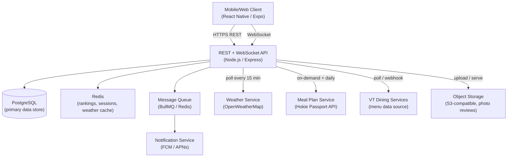
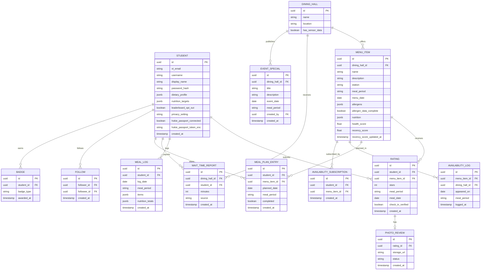

# Design Document: VT Dining Ranker

## Overview

VT Dining Ranker is a mobile-first web application (React Native or React + Expo) that gives Virginia Tech students a real-time, personalized view of campus dining. The system aggregates menu data from VT Dining Services, crowdsourced ratings and wait-time reports, nutritional data, weather conditions, and meal plan balances to surface the best food available right now.

The core value loop is:
1. Students open the app and immediately see what's good, what's trending, and how long the wait is.
2. They rate what they eat, which feeds the ranking engine for everyone else.
3. Personalization (dietary profiles, past ratings, weather) makes recommendations increasingly relevant.
4. Social and gamification layers keep engagement high.

### Key Design Decisions

- **Recency-weighted ranking** over simple averages — freshness of ratings matters more than historical averages for a dining context where menus change daily.
- **Crowdsourced wait times** with sensor augmentation — no dedicated hardware required, but sensor data improves accuracy where available.
- **Dietary filtering at the query layer** — filters are applied server-side before results reach the client, preventing accidental exposure of unsafe items.
- **Privacy-first social layer** — activity visibility defaults to friends-only; private mode fully excludes a student from all feeds.

---

## Architecture

The system follows a client–server architecture with a real-time layer for live updates.



### Real-Time Strategy

- **Rankings and trending feed**: Server pushes updates over WebSocket every 30 seconds (rankings) and 60 seconds (trending feed). Clients subscribe to a channel per dining hall.
- **Social feed**: New friend activity is pushed via WebSocket within 60 seconds of the triggering event.
- **Notifications**: Meal plan reminders and menu-change alerts are dispatched through a background job queue to FCM/APNs.

### Caching Strategy

| Data | Cache TTL | Rationale |
|---|---|---|
| Recency scores | 30 s | Updated on every new rating; stale reads acceptable within window |
| Trending feed | 60 s | Refreshed on schedule |
| Weather data | 15 min | Per requirement 9.1 |
| Menu data | 5 min | Per requirement 1.3 |
| Meal plan balance | 24 h | Per requirement 14.3 |

---

## Components and Interfaces

### 1. Menu Service

Responsible for fetching, caching, and serving menu data from VT Dining Services.

```
GET /api/dining-halls                          → list of dining halls with open/closed status
GET /api/dining-halls/:id/menu                 → current meal period menu, organized by station
GET /api/dining-halls/:id/menu?date=&period=   → future menu for meal planning
GET /api/menu-items/:id                        → item detail (name, description, ingredients, allergens, health score, nutrition)
```

- Polls VT Dining Services every 5 minutes; diffs against cached version and emits `menu.updated` events.
- On unavailability, returns cached data with a `stale: true` flag; clients render "Menu unavailable" when no cache exists.

### 2. Rating Service

Handles rating submission, validation, and Recency_Score computation.

```
POST /api/ratings                              → submit a rating (requires check-in or confirmation)
GET  /api/menu-items/:id/ratings               → paginated ratings for an item
GET  /api/dining-halls/:id/ranked-items        → ranked list sorted by Recency_Score
```

- Validates: student checked in within 90 min OR explicit confirmation; one rating per item per meal period.
- After recording a rating, enqueues a `recency.recompute` job for the affected item.
- Recency_Score recomputation runs within 10 seconds via the queue worker.

### 3. Recency Score Engine

Computes time-decayed composite scores.

```
recency_score(item) = Σ [ rating_i * decay(t_i) ]  /  Σ [ decay(t_i) ]

decay(t) = exp(-λ * t_hours)
  where λ is chosen so that decay(6h) ≤ 0.5 * decay(0h)  →  λ = ln(2)/6 ≈ 0.1155
```

This ensures ratings within the past 60 minutes carry at least twice the weight of ratings older than 6 hours (requirement 2.2).

### 4. Trending Feed Service

```
GET /api/trending                              → top 10 items by rating activity in past 60 min
```

- Runs a scheduled job every 60 seconds; queries items with ≥1 rating in the past 60 minutes, sorts by count × recency_score, takes top 10.
- Returns `{ items: [], insufficient_activity: bool }` — `insufficient_activity: true` when fewer than 3 items qualify.

### 5. Dietary Filter Service

Applied as middleware on any endpoint returning menu items.

- Reads the student's active `Dietary_Profile` from the session/token.
- Excludes items that conflict with restrictions before the response is serialized.
- Items with incomplete allergen data are excluded by default; included only if `opt_in_incomplete_allergens: true` is set on the profile.
- Allergen warnings are injected into item detail responses when a match is found.

### 6. Health Score Service

```
health_score(item) = f(calories, protein, carbs, fat, fiber, sodium)
```

Deterministic formula (documented in code):
- Base score starts at 10.
- Deductions: excess calories (>600 kcal/serving: −2), high sodium (>800 mg: −2), high added sugar (>20 g: −1).
- Bonuses: high fiber (>5 g: +1), high protein (>20 g: +1).
- Clamped to [1, 10].

### 7. Nutritional Tracking Service

```
POST /api/meal-logs                            → log a meal (array of menu item IDs + servings)
GET  /api/meal-logs?date=&range=daily|weekly   → nutritional summary
PUT  /api/nutrition-targets                    → set daily calorie/macro targets
```

- Aggregates macros from logged items; stores daily totals.
- Retains logs for 90 days (soft-delete after that).

### 8. Wait Time Service

```
POST /api/wait-time-reports                    → submit crowdsourced wait time
GET  /api/dining-halls/:id/wait-time           → current estimate
```

- Weighted average of reports in the past 30 minutes (exponential decay by age).
- Sensor data (where available) is treated as a high-weight report.
- Returns `{ minutes: null, unknown: true }` when no data in 30 min and no sensor data.

### 9. Recommendation Engine

```
GET /api/recommendations?input=               → personalized recommendations
```

Scoring pipeline:
1. Filter: available now + satisfies dietary profile.
2. Score: `base_score = recency_score * 0.4 + rating_history_affinity * 0.3 + cuisine_preference_match * 0.2 + weather_boost * 0.1`
3. Weather boost: +20% weight on warm/comfort items when temp < 35°F or precipitation; +20% on cold/light items when temp > 85°F.
4. Natural language input (e.g., "something spicy") is parsed into tags and used to filter/re-rank.
5. If no results satisfy all filters, iteratively relax one filter at a time and notify the student.

### 10. Social Service

```
POST /api/follows                              → follow a student
DELETE /api/follows/:id                        → unfollow
GET  /api/social-feed                          → paginated activity feed
PUT  /api/privacy-settings                     → set visibility (public | friends | private)
```

- Activity events (rating submitted, meal logged) are published to a fan-out queue.
- Fan-out respects privacy settings: private users' events are dropped before fan-out.
- Feed updates pushed to followers via WebSocket within 60 seconds.

### 11. Photo Review Service

```
POST /api/ratings/:id/photo                    → upload photo (multipart, JPEG/PNG, ≤10 MB)
POST /api/photos/:id/report                    → report inappropriate photo
```

- Photos stored in S3-compatible object storage; CDN-served.
- On report: photo hidden within 5 minutes (status set to `hidden`); moderation job queued.
- Photo appears on item detail page within 30 seconds of upload (WebSocket push).

### 12. Gamification Service

```
GET /api/students/:id/gamification             → streak, badges, leaderboard rank
GET /api/leaderboard/weekly                    → top 20 by ratings this week
```

- Streak incremented by a daily cron job that checks if the student logged a meal that calendar day.
- Badge awards triggered by event listeners on meal-log and rating events.
- Leaderboard opt-out flag stored on student profile; opted-out students excluded from leaderboard queries.

### 13. Meal Planning Service

```
GET  /api/meal-plans                           → student's planned meals
POST /api/meal-plans                           → add item to plan
PUT  /api/meal-plans/:id/complete              → mark as completed (auto-logs nutrition)
```

- Scheduled notification jobs created when a meal plan entry is saved.
- Menu-change events trigger a check against all meal plan entries for the affected item; notifications dispatched if a match is found.

### 14. Meal Plan (Hokie Passport) Service

```
GET /api/hokie-passport/balance                → current swipes + dining dollars
POST /api/hokie-passport/connect               → link Hokie Passport account
POST /api/hokie-passport/refresh               → manual refresh
```

- Polls Meal_Plan_Service daily; on-demand on manual refresh.
- Caches last known balance; returns with `stale: true` flag when service is unavailable.
- Low-balance warning (< 5 swipes) computed at read time.

### 15. Event Specials Service

```
POST /api/event-specials                       → publish special (staff only)
GET  /api/dining-halls/:id/specials            → active specials for a hall
```

- Staff role required for publishing.
- Special announcements appear in the dining hall page and are injected into the Trending_Feed.
- Notification dispatched to students who have favorited the dining hall.

### 16. Availability History and Prediction Service

Tracks every menu appearance and predicts future availability using recurrence pattern analysis.

```
GET /api/menu-items/:id/availability-history   → full appearance log (date, meal_period, dining_hall)
GET /api/menu-items/:id/availability-prediction → predicted next appearance(s)
POST /api/menu-items/:id/subscribe             → subscribe to availability notifications
DELETE /api/menu-items/:id/subscribe           → unsubscribe
```

- Every time the Menu Service ingests a menu, it upserts an `AVAILABILITY_LOG` record for each item present.
- Prediction algorithm:
  1. Group historical appearances by `(day_of_week, meal_period, dining_hall_id)`.
  2. Compute appearance frequency per group over the trailing 90 days.
  3. Groups with ≥ 4 appearances are considered recurring patterns.
  4. The predicted next occurrence is the nearest future `(day_of_week, meal_period)` whose frequency exceeds a configurable threshold (default: ≥ 25% of weeks in the window).
  5. If fewer than 4 total appearances exist, return `{ prediction_available: false }`.
- Predictions are recomputed daily via a scheduled job.
- When a prediction indicates an item is likely within 24 hours, a `availability_prediction` notification job is enqueued for all subscribers.
- When the item appears on a confirmed upcoming menu, an `availability_confirmed` notification is sent regardless of prediction state.

### 17. Notification Service

Centralized dispatcher for all push notifications.

- Consumes jobs from the message queue.
- Sends via FCM (Android) and APNs (iOS).
- Job types: `meal_plan_reminder`, `menu_change`, `streak_broken`, `badge_awarded`, `event_special`, `social_activity`, `availability_prediction`, `availability_confirmed`.

---

## Data Models



### Key Schema Notes

- `MENU_ITEM.nutrition` is a JSONB blob: `{ calories, protein_g, carbs_g, fat_g, fiber_g, sodium_mg, added_sugar_g }`.
- `MENU_ITEM.allergens` is a JSONB array of allergen tag strings.
- `MEAL_LOG.items` is a JSONB array of `{ menu_item_id, servings }`.
- `STUDENT.dietary_profile` is a JSONB object: `{ restrictions: string[], allergens: string[], active: bool, opt_in_incomplete: bool }`.
- `WAIT_TIME_REPORT.source` is `"crowdsource"` or `"sensor"`.
- `PHOTO_REVIEW.status` is one of `"visible"`, `"hidden"`, `"removed"`.


---

## Correctness Properties

*A property is a characteristic or behavior that should hold true across all valid executions of a system — essentially, a formal statement about what the system should do. Properties serve as the bridge between human-readable specifications and machine-verifiable correctness guarantees.*

### Property 1: Menu items are grouped by station

*For any* dining hall, the menu endpoint response should contain items where every item has a non-null `station` field, and items with the same station value are grouped together in the response.

**Validates: Requirements 1.1**

---

### Property 2: Menu item detail contains all required fields

*For any* menu item with complete data, the detail response should include `name`, `description`, `ingredients`, `allergen_tags`, `health_score`, `calories`, `protein_g`, `carbs_g`, `fat_g`, `fiber_g`, and `sodium_mg`.

**Validates: Requirements 1.2, 5.2**

---

### Property 3: Active meal period is always present

*For any* dining hall response, the `meal_period` field should be present and be one of `breakfast`, `lunch`, `dinner`, or `late_night`.

**Validates: Requirements 1.5**

---

### Property 4: Recency decay weight ratio

*For any* two ratings where one is submitted at time t=0 and another at t=6 hours, the decay weight of the t=0 rating should be at least twice the decay weight of the t=6h rating (i.e., `decay(0) / decay(6h) >= 2`).

**Validates: Requirements 2.2**

---

### Property 5: Ranked list invariants

*For any* ranked list of menu items, (a) items should be sorted in descending order of `recency_score`, and (b) every item in the list should have `available: true` for the current meal period.

**Validates: Requirements 2.3, 2.5**

---

### Property 6: Rating submission requires check-in or confirmation

*For any* rating submission where the student has not checked in within 90 minutes and has not provided explicit confirmation, the system should reject the submission with an appropriate error.

**Validates: Requirements 2.4**

---

### Property 7: One rating per item per meal period

*For any* student, menu item, and meal period, submitting a second rating for the same item in the same meal period should be rejected.

**Validates: Requirements 2.6**

---

### Property 8: Trending feed size and recency

*For any* trending feed response, (a) the feed should contain at most 10 items, and (b) every item in the feed should have received at least one rating in the past 60 minutes.

**Validates: Requirements 3.1**

---

### Property 9: Trending feed item fields

*For any* item appearing in the trending feed, the response should include `name`, `dining_hall`, `recency_score`, and `rating_count_60min`.

**Validates: Requirements 3.3**

---

### Property 10: Dietary profile round-trip

*For any* dietary profile saved by a student, retrieving the profile should return the same restrictions and allergens that were saved.

**Validates: Requirements 4.1**

---

### Property 11: Dietary filter excludes conflicting items

*For any* student with an active dietary profile and any endpoint returning menu items (ranked list, recommendations, search), no returned item should have a restriction or allergen that conflicts with the student's profile.

**Validates: Requirements 4.2**

---

### Property 12: Allergen warning on conflicting items

*For any* menu item that contains an allergen matching the student's dietary profile, the item detail response should include an `allergen_warning: true` field.

**Validates: Requirements 4.3**

---

### Property 13: Dietary filter disable/re-enable preserves profile

*For any* dietary profile, disabling filtering and then re-enabling it should leave the profile's restrictions and allergens unchanged.

**Validates: Requirements 4.4**

---

### Property 14: Incomplete allergen items excluded by default

*For any* menu item with `allergen_data_complete: false`, it should be excluded from filtered results unless the student's profile has `opt_in_incomplete: true`.

**Validates: Requirements 4.5**

---

### Property 15: Health score is in range [1, 10]

*For any* menu item with complete nutritional data, the computed `health_score` should be a number in the closed interval [1, 10].

**Validates: Requirements 5.1**

---

### Property 16: Health score is deterministic

*For any* nutritional input object, calling the health score function twice with the same inputs should return the same score.

**Validates: Requirements 5.3**

---

### Property 17: Nutritional log accuracy

*For any* meal log containing one or more menu items, the stored daily totals for calories, protein, carbs, fat, fiber, and sodium should equal the sum of each item's nutritional values multiplied by servings.

**Validates: Requirements 6.1, 6.2**

---

### Property 18: Nutrition targets round-trip

*For any* set of daily calorie and macronutrient targets saved by a student, the nutritional summary response should reflect those targets in the progress fields.

**Validates: Requirements 6.3**

---

### Property 19: Over-target indicator

*For any* student whose logged calories for the day exceed their set daily calorie target, the nutritional summary response should include `over_calorie_target: true`.

**Validates: Requirements 6.4**

---

### Property 20: Wait time estimate uses recency weighting

*For any* set of crowdsourced wait time reports for a dining hall, the computed wait time estimate should be a weighted average where more recent reports have strictly higher weight than older reports.

**Validates: Requirements 7.3**

---

### Property 21: Recommendations satisfy dietary profile

*For any* student with an active dietary profile requesting recommendations, every returned recommendation should be currently available at an open dining hall and should satisfy the student's dietary profile.

**Validates: Requirements 8.1**

---

### Property 22: Weather boost applied correctly

*For any* set of available items including warm/comfort items, when weather conditions include precipitation or temperature below 35°F, the score of warm/comfort items should be at least 1.2× their baseline score; when temperature is above 85°F, the score of cold/light items should be at least 1.2× their baseline score.

**Validates: Requirements 8.3, 8.4**

---

### Property 23: Input-based recommendation filtering

*For any* explicit user input tag (e.g., "spicy", "light"), all returned recommendations should match that tag.

**Validates: Requirements 8.5**

---

### Property 24: Weather response contains required fields

*For any* successful weather data fetch, the response should include `temperature_f` and `conditions` fields.

**Validates: Requirements 9.2**

---

### Property 25: Follow/unfollow round-trip

*For any* two students A and B, after A follows B the follow relationship should exist; after A unfollows B the follow relationship should no longer exist.

**Validates: Requirements 10.1, 10.5**

---

### Property 26: Privacy setting round-trip

*For any* privacy setting value (`public`, `friends`, `private`), saving it and then retrieving the student's settings should return the same value.

**Validates: Requirements 10.3**

---

### Property 27: Private student excluded from all feeds

*For any* student with `privacy_setting: private`, their activity (ratings, meal logs) should not appear in any other student's social feed or in the trending feed.

**Validates: Requirements 10.4**

---

### Property 28: Photo upload validation

*For any* image file, if it is not JPEG or PNG format, or if its size exceeds 10 MB, the upload should be rejected; if it is JPEG or PNG and ≤ 10 MB, it should be accepted.

**Validates: Requirements 11.2**

---

### Property 29: Reported photo is hidden

*For any* photo review that has been reported, its `status` field should be `hidden` (not `visible`).

**Validates: Requirements 11.5**

---

### Property 30: Streak increments on daily meal log

*For any* student who logs at least one meal on a new calendar day (after having logged on the previous day), their streak should increase by exactly 1.

**Validates: Requirements 12.1**

---

### Property 31: Foodie Explorer badge awarded correctly

*For any* student who rates exactly 10 or more distinct menu items they have not previously rated within any 7-day window, the "Foodie Explorer" badge should be awarded.

**Validates: Requirements 12.3**

---

### Property 32: Leaderboard ordering and size

*For any* weekly leaderboard, it should contain at most 20 students, sorted in descending order by number of ratings submitted that week.

**Validates: Requirements 12.4**

---

### Property 33: Streak resets to 0 on missed day

*For any* student who misses a calendar day without logging a meal, their streak should be 0 after the reset.

**Validates: Requirements 12.5**

---

### Property 34: Leaderboard opt-out preserves streak and badges

*For any* student who opts out of the leaderboard, (a) they should not appear in leaderboard results, and (b) their streak count and badge list should be unchanged.

**Validates: Requirements 12.6**

---

### Property 35: Meal plan add round-trip

*For any* menu item added to a student's meal plan for a specific date and meal period, retrieving the meal plan should include that item for that date and period.

**Validates: Requirements 13.2**

---

### Property 36: Completing a meal plan entry logs nutrition

*For any* meal plan entry marked as completed, the student's nutritional log for that date should include the nutrition data of the planned menu item.

**Validates: Requirements 13.5**

---

### Property 37: Meal plan balance display

*For any* student with a connected Hokie Passport account, the home screen response should include `meal_swipes_remaining` and `dining_dollars_balance` fields; if `meal_swipes_remaining < 5`, the response should include `low_balance_warning: true`.

**Validates: Requirements 14.1, 14.2**

---

### Property 38: Event special appears in dining hall page and trending feed

*For any* published event special, it should appear in both the corresponding dining hall's specials list and in the trending feed response.

**Validates: Requirements 15.2**

---

### Property 39: Event special has distinct indicator

*For any* event special in any response, it should include a `is_event_special: true` field to distinguish it from regular menu items.

**Validates: Requirements 15.4**

---

### Property 40: Availability log records every menu appearance

*For any* menu item that appears in a menu ingestion, an `AVAILABILITY_LOG` record should exist for that item, dining hall, date, and meal period after ingestion completes.

**Validates: Requirements 17.1**

---

### Property 41: Availability prediction requires minimum history

*For any* menu item with fewer than 4 historical appearances, the prediction endpoint should return `{ prediction_available: false }`.

**Validates: Requirements 17.6**

---

### Property 42: Availability prediction is based on recurrence patterns

*For any* menu item with 4 or more appearances, the predicted next occurrence should correspond to a `(day_of_week, meal_period)` group that appears in the item's historical log.

**Validates: Requirements 17.4**

---

### Property 43: Subscription round-trip

*For any* student who subscribes to a menu item, the subscription should exist; after unsubscribing, it should no longer exist.

**Validates: Requirements 17.7**

---

## Error Handling

| Scenario | Behavior |
|---|---|
| VT Dining Services unavailable | Return cached menu with `stale: true`; if no cache, return `{ available: false, message: "Menu unavailable" }` per dining hall |
| Weather Service unavailable | Use cached weather data; include `weather_stale: true` in response |
| Meal Plan Service unavailable | Use cached balance; include `balance_stale: true` in response |
| Rating submitted without check-in | Return `400 Bad Request` with `error: "check_in_required"` |
| Duplicate rating in same meal period | Return `409 Conflict` with `error: "already_rated"` |
| Photo upload exceeds 10 MB or wrong format | Return `422 Unprocessable Entity` with `error: "invalid_photo"` |
| Recommendation with no matching items | Return progressive filter relaxation suggestions; never return an empty list without explanation |
| Trending feed with < 3 active items | Return `{ items: [], insufficient_activity: true }` |
| No wait time data in past 30 min | Return `{ minutes: null, unknown: true }` |
| Nutritional data missing for item | Return `{ health_score: null, nutrition_unavailable: true }` |
| Staff attempts to publish special without authorization | Return `403 Forbidden` |
| Availability prediction requested with < 4 appearances | Return `{ prediction_available: false, message: "Not enough history to predict" }` |
| WebSocket connection lost | Client reconnects with exponential backoff; server replays last known state on reconnect |

---

## Testing Strategy

### Dual Testing Approach

Both unit tests and property-based tests are required. They are complementary:
- Unit tests catch concrete bugs in specific scenarios and edge cases.
- Property-based tests verify universal correctness across all valid inputs.

### Property-Based Testing

**Library**: [fast-check](https://github.com/dubzzz/fast-check) (TypeScript/JavaScript)

Each property-based test must:
- Run a minimum of **100 iterations**.
- Include a comment referencing the design property it validates.
- Use the tag format: `Feature: vt-dining-ranker, Property {N}: {property_text}`

Each correctness property listed above must be implemented by exactly one property-based test.

Example test structure:

```typescript
// Feature: vt-dining-ranker, Property 4: Recency decay weight ratio
it('decay(0) / decay(6h) >= 2 for all valid lambda', () => {
  fc.assert(
    fc.property(fc.float({ min: 0.01, max: 1.0 }), (lambda) => {
      const decay = (t: number) => Math.exp(-lambda * t);
      return decay(0) / decay(6) >= 2;
    }),
    { numRuns: 100 }
  );
});
```

### Unit Testing

Unit tests should focus on:
- Specific examples that demonstrate correct behavior (e.g., badge award at exactly 7-day streak milestone).
- Integration points between components (e.g., rating submission triggers recency score recomputation job).
- Edge cases: empty trending feed, missing nutritional data, unavailable external services.
- Error conditions: invalid photo format, duplicate rating, unauthorized staff action.

Avoid writing unit tests that duplicate what property tests already cover (e.g., don't write a unit test for "sorted list" if a property test already covers it for all inputs).

### Test Coverage Targets

| Layer | Target |
|---|---|
| Recency Score Engine | 100% branch coverage (pure function) |
| Health Score Service | 100% branch coverage (pure function) |
| Dietary Filter Service | 100% branch coverage |
| Rating Service validation | 100% branch coverage |
| API endpoints | Integration tests for all happy paths and documented error cases |
| Property tests | One test per correctness property, ≥100 iterations each |
