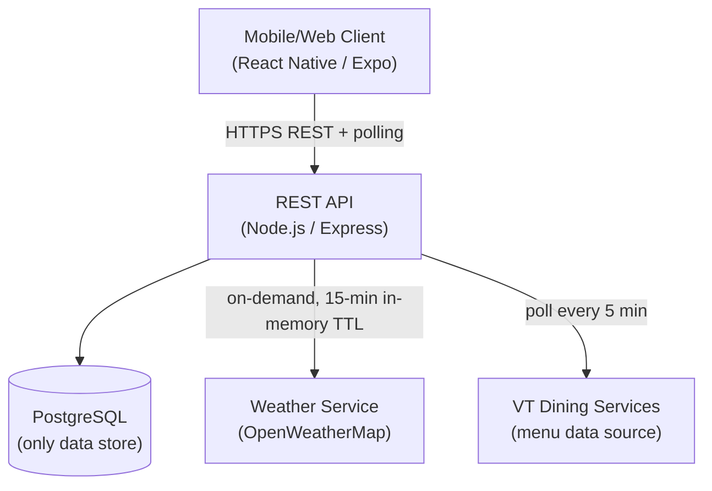
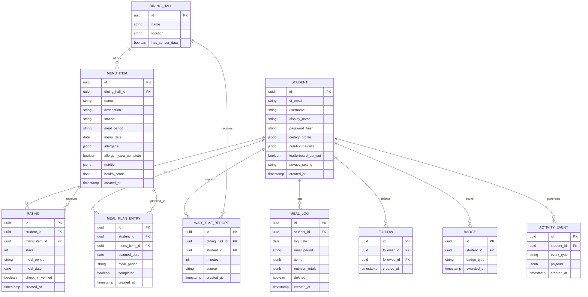

# Design Document: VT Dining Ranker

## Overview

VT Dining Ranker is a mobile-first web application (React Native + Expo) that gives Virginia Tech students a real-time, personalized view of campus dining. The system aggregates menu data from VT Dining Services, crowdsourced ratings and wait-time reports, nutritional data, and weather conditions to surface the best food available right now.

The core value loop is:
1. Students open the app and immediately see what's good, what's trending, and how long the wait is.
2. They rate what they eat, which feeds the ranking engine for everyone else.
3. Personalization (dietary profiles, past ratings, weather) makes recommendations increasingly relevant.
4. Social and gamification layers keep engagement high.

### Key Design Decisions

- **Recency-weighted ranking** over simple averages — freshness of ratings matters more than historical averages for a dining context where menus change daily.
- **Synchronous computation** — recency scores and trending feeds are computed on every request directly from PostgreSQL; no background workers or caches needed at this scale.
- **Crowdsourced wait times** with sensor augmentation — no dedicated hardware required, but sensor data improves accuracy where available.
- **Dietary filtering at the query layer** — filters are applied server-side before results reach the client, preventing accidental exposure of unsafe items.
- **Privacy-first social layer** — activity visibility defaults to friends-only; private mode fully excludes a student from all feeds.
- **In-memory weather cache** — weather data is fetched on-demand from OpenWeatherMap and cached in a module-level variable with a 15-minute TTL; no external cache store required.

---

## Architecture

The system follows a straightforward client–server architecture. The client polls REST endpoints; there is no WebSocket layer.



### Polling Strategy

- **Rankings**: Client polls `GET /api/dining-halls/:id/ranked-items` every 30 seconds.
- **Trending feed**: Client polls `GET /api/trending` every 60 seconds.
- **Social feed**: Client polls `GET /api/social-feed` every 60 seconds.
- **Wait times**: Client polls `GET /api/dining-halls/:id/wait-time` on screen focus.

### Caching Strategy

There is no external cache layer. All data is served directly from PostgreSQL.

The single exception is weather data: the weather module holds a module-level variable `{ data, fetchedAt }`. On each request that needs weather, if `now - fetchedAt < 15 minutes` the cached value is returned; otherwise a fresh fetch from OpenWeatherMap is made and the variable is updated. This requires no Redis or external infrastructure.

| Data | Strategy | Rationale |
|---|---|---|
| Menu data | Direct Postgres query | Menus change infrequently; query is fast |
| Recency scores | Computed on request | Synchronous aggregation over recent ratings |
| Trending feed | Computed on request | Simple COUNT + score query over past 60 min |
| Weather data | In-memory module variable, 15-min TTL | Avoids hammering OpenWeatherMap; no Redis needed |
| Wait times | Direct Postgres query | Weighted average over past 30 min |

---

## Components and Interfaces

### 1. Menu Service

Responsible for fetching, storing, and serving menu data from VT Dining Services.

```
GET /api/dining-halls                          → list of dining halls with open/closed status
GET /api/dining-halls/:id/menu                 → current meal period menu, organized by station
GET /api/dining-halls/:id/menu?date=&period=   → future menu for meal planning
GET /api/menu-items/:id                        → item detail (name, description, ingredients, allergens, health score, nutrition)
```

- Polls VT Dining Services every 5 minutes; diffs against stored version and upserts changed rows.
- On unavailability, returns the most recently stored data with a `stale: true` flag; returns `{ available: false }` per dining hall when no data exists at all.

### 2. Rating Service

Handles rating submission, validation, and Recency_Score computation.

```
POST /api/ratings                              → submit a rating (requires check-in or confirmation)
GET  /api/menu-items/:id/ratings               → paginated ratings for an item
GET  /api/dining-halls/:id/ranked-items        → ranked list sorted by Recency_Score (computed on request)
```

- Validates: student checked in within 90 min OR explicit confirmation; one rating per item per meal period.
- After recording a rating, the updated recency score is available immediately on the next ranked-items request (no async job needed).

### 3. Recency Score Engine

Computes time-decayed composite scores synchronously on every ranked-list request.

```
recency_score(item) = Σ [ rating_i * decay(t_i) ]  /  Σ [ decay(t_i) ]

decay(t) = exp(-λ * t_hours)
  where λ = ln(2)/6 ≈ 0.1155
```

This ensures ratings within the past 60 minutes carry at least twice the weight of ratings older than 6 hours (requirement 2.2). The computation runs as a SQL expression over the `RATING` table filtered to the current meal period.

### 4. Trending Feed Service

```
GET /api/trending                              → top 10 items by rating activity in past 60 min
```

- Computed on every request: queries items with ≥1 rating in the past 60 minutes, sorts by `count × recency_score`, takes top 10.
- Returns `{ items: [], insufficient_activity: true }` when fewer than 3 items qualify.

### 5. Dietary Filter Service

Applied as Express middleware on any endpoint returning menu items.

- Reads the student's active `Dietary_Profile` from the JWT.
- Excludes items that conflict with restrictions before the response is serialized.
- Items with incomplete allergen data are excluded by default; included only if `opt_in_incomplete_allergens: true` is set on the profile.
- Allergen warnings are injected into item detail responses when a match is found.

### 6. Health Score Service

```
health_score(item) = f(calories, protein, carbs, fat, fiber, sodium)
```

Deterministic formula (documented in code):
- Base score starts at 10.
- Deductions: excess calories (>600 kcal/serving: −2), high sodium (>800 mg: −2), high added sugar (>20 g: −1).
- Bonuses: high fiber (>5 g: +1), high protein (>20 g: +1).
- Clamped to [1, 10].

### 7. Nutritional Tracking Service

```
POST /api/meal-logs                            → log a meal (array of menu item IDs + servings)
GET  /api/meal-logs?date=&range=daily|weekly   → nutritional summary
PUT  /api/nutrition-targets                    → set daily calorie/macro targets
```

- Aggregates macros from logged items; stores daily totals.
- Retains logs for 90 days (soft-delete after that).

### 8. Wait Time Service

```
POST /api/wait-time-reports                    → submit crowdsourced wait time
GET  /api/dining-halls/:id/wait-time           → current estimate
```

- Weighted average of reports in the past 30 minutes (exponential decay by age), computed on request.
- Sensor data (where available) is treated as a high-weight report.
- Returns `{ minutes: null, unknown: true }` when no data in 30 min and no sensor data.

### 9. Weather Service

```typescript
// Module-level in-memory cache — no Redis required
let weatherCache: { data: WeatherData; fetchedAt: number } | null = null;

async function getCurrentWeather(): Promise<WeatherData> {
  const now = Date.now();
  if (weatherCache && now - weatherCache.fetchedAt < 15 * 60 * 1000) {
    return weatherCache.data;
  }
  const data = await fetchFromOpenWeatherMap();
  weatherCache = { data, fetchedAt: now };
  return data;
}
```

- Called on-demand by the Recommendation Engine and the home screen endpoint.
- Returns `{ temperature_f, conditions, stale: true }` when the external service is unavailable and a cached value exists.

### 10. Recommendation Engine

```
GET /api/recommendations?input=               → personalized recommendations
```

Scoring pipeline:
1. Filter: available now + satisfies dietary profile.
2. Fetch current weather via `getCurrentWeather()` (uses in-memory cache).
3. Score: `base_score = recency_score * 0.4 + rating_history_affinity * 0.3 + cuisine_preference_match * 0.2 + weather_boost * 0.1`
4. Weather boost: +20% weight on warm/comfort items when temp < 35°F or precipitation; +20% on cold/light items when temp > 85°F.
5. Natural language input (e.g., "something spicy") is parsed into tags and used to filter/re-rank.
6. If no results satisfy all filters, iteratively relax one filter at a time and notify the student.

### 11. Social Service

```
POST /api/follows                              → follow a student
DELETE /api/follows/:id                        → unfollow
GET  /api/social-feed                          → paginated activity feed (client polls every 60 s)
PUT  /api/privacy-settings                     → set visibility (public | friends | private)
```

- Activity events (rating submitted, meal logged) are written to an `ACTIVITY_EVENT` table at write time.
- Feed query joins `FOLLOW` with `ACTIVITY_EVENT`, filtered by privacy settings.
- Private users' events are excluded at query time.

### 12. Gamification Service

```
GET /api/students/:id/gamification             → streak, badges, leaderboard rank
GET /api/leaderboard/weekly                    → top 20 by ratings this week
```

- Streak is computed at read time from the `MEAL_LOG` table (consecutive calendar days with ≥1 log).
- Badge awards are triggered synchronously when a meal log or rating is submitted (checked inline in the service layer).
- Leaderboard opt-out flag stored on student profile; opted-out students excluded from leaderboard queries.

### 13. Meal Planning Service

```
GET  /api/meal-plans                           → student's planned meals
POST /api/meal-plans                           → add item to plan
PUT  /api/meal-plans/:id/complete              → mark as completed (auto-logs nutrition)
```

- Stores planned meals in `MEAL_PLAN_ENTRY`. No push notifications — students check the app to see their plan.
- On complete: auto-logs nutrition to `MEAL_LOG` for that date.

---

## Data Models



### Key Schema Notes

- `MENU_ITEM.nutrition` is a JSONB blob: `{ calories, protein_g, carbs_g, fat_g, fiber_g, sodium_mg, added_sugar_g }`.
- `MENU_ITEM.allergens` is a JSONB array of allergen tag strings.
- `MEAL_LOG.items` is a JSONB array of `{ menu_item_id, servings }`.
- `MEAL_LOG.deleted` is a soft-delete flag; rows are excluded from queries after 90 days.
- `STUDENT.dietary_profile` is a JSONB object: `{ restrictions: string[], allergens: string[], active: bool, opt_in_incomplete: bool }`.
- `WAIT_TIME_REPORT.source` is `"crowdsource"` or `"sensor"`.
- `ACTIVITY_EVENT.event_type` is one of `"rating_submitted"` or `"meal_logged"`.
- `ACTIVITY_EVENT.payload` contains enough data to render the feed item (item name, dining hall, stars, etc.) without additional joins.

---

## Correctness Properties

*A property is a characteristic or behavior that should hold true across all valid executions of a system — essentially, a formal statement about what the system should do. Properties serve as the bridge between human-readable specifications and machine-verifiable correctness guarantees.*

### Property 1: Menu items are grouped by station

*For any* dining hall, the menu endpoint response should contain items where every item has a non-null `station` field, and items with the same station value are grouped together in the response.

**Validates: Requirements 1.1**

---

### Property 2: Menu item detail contains all required fields

*For any* menu item with complete data, the detail response should include `name`, `description`, `ingredients`, `allergen_tags`, `health_score`, `calories`, `protein_g`, `carbs_g`, `fat_g`, `fiber_g`, and `sodium_mg`.

**Validates: Requirements 1.2, 5.2**

---

### Property 3: Active meal period is always present

*For any* dining hall response, the `meal_period` field should be present and be one of `breakfast`, `lunch`, `dinner`, or `late_night`.

**Validates: Requirements 1.5**

---

### Property 4: Recency decay weight ratio

*For any* two ratings where one is submitted at time t=0 and another at t=6 hours, the decay weight of the t=0 rating should be at least twice the decay weight of the t=6h rating (i.e., `decay(0) / decay(6h) >= 2`).

**Validates: Requirements 2.2**

---

### Property 5: Ranked list invariants

*For any* ranked list of menu items, (a) items should be sorted in descending order of `recency_score`, and (b) every item in the list should have `available: true` for the current meal period.

**Validates: Requirements 2.3, 2.5**

---

### Property 6: Rating submission requires check-in or confirmation

*For any* rating submission where the student has not checked in within 90 minutes and has not provided explicit confirmation, the system should reject the submission with an appropriate error.

**Validates: Requirements 2.4**

---

### Property 7: One rating per item per meal period

*For any* student, menu item, and meal period, submitting a second rating for the same item in the same meal period should be rejected.

**Validates: Requirements 2.6**

---

### Property 8: Trending feed size and recency

*For any* trending feed response, (a) the feed should contain at most 10 items, and (b) every item in the feed should have received at least one rating in the past 60 minutes.

**Validates: Requirements 3.1**

---

### Property 9: Trending feed item fields

*For any* item appearing in the trending feed, the response should include `name`, `dining_hall`, `recency_score`, and `rating_count_60min`.

**Validates: Requirements 3.3**

---

### Property 10: Dietary profile round-trip

*For any* dietary profile saved by a student, retrieving the profile should return the same restrictions and allergens that were saved.

**Validates: Requirements 4.1**

---

### Property 11: Dietary filter excludes conflicting items

*For any* student with an active dietary profile and any endpoint returning menu items (ranked list, recommendations, search), no returned item should have a restriction or allergen that conflicts with the student's profile.

**Validates: Requirements 4.2**

---

### Property 12: Allergen warning on conflicting items

*For any* menu item that contains an allergen matching the student's dietary profile, the item detail response should include an `allergen_warning: true` field.

**Validates: Requirements 4.3**

---

### Property 13: Dietary filter disable/re-enable preserves profile

*For any* dietary profile, disabling filtering and then re-enabling it should leave the profile's restrictions and allergens unchanged.

**Validates: Requirements 4.4**

---

### Property 14: Incomplete allergen items excluded by default

*For any* menu item with `allergen_data_complete: false`, it should be excluded from filtered results unless the student's profile has `opt_in_incomplete: true`.

**Validates: Requirements 4.5**

---

### Property 15: Health score is in range [1, 10]

*For any* menu item with complete nutritional data, the computed `health_score` should be a number in the closed interval [1, 10].

**Validates: Requirements 5.1**

---

### Property 16: Health score is deterministic

*For any* nutritional input object, calling the health score function twice with the same inputs should return the same score.

**Validates: Requirements 5.3**

---

### Property 17: Nutritional log accuracy

*For any* meal log containing one or more menu items, the stored daily totals for calories, protein, carbs, fat, fiber, and sodium should equal the sum of each item's nutritional values multiplied by servings.

**Validates: Requirements 6.1, 6.2**

---

### Property 18: Nutrition targets round-trip

*For any* set of daily calorie and macronutrient targets saved by a student, the nutritional summary response should reflect those targets in the progress fields.

**Validates: Requirements 6.3**

---

### Property 19: Over-target indicator

*For any* student whose logged calories for the day exceed their set daily calorie target, the nutritional summary response should include `over_calorie_target: true`.

**Validates: Requirements 6.4**

---

### Property 20: Wait time estimate uses recency weighting

*For any* set of crowdsourced wait time reports for a dining hall, the computed wait time estimate should be a weighted average where more recent reports have strictly higher weight than older reports.

**Validates: Requirements 7.3**

---

### Property 21: Recommendations satisfy dietary profile

*For any* student with an active dietary profile requesting recommendations, every returned recommendation should be currently available at an open dining hall and should satisfy the student's dietary profile.

**Validates: Requirements 8.1**

---

### Property 22: Weather boost applied correctly

*For any* set of available items including warm/comfort items, when weather conditions include precipitation or temperature below 35°F, the score of warm/comfort items should be at least 1.2× their baseline score; when temperature is above 85°F, the score of cold/light items should be at least 1.2× their baseline score.

**Validates: Requirements 8.3, 8.4**

---

### Property 23: Input-based recommendation filtering

*For any* explicit user input tag (e.g., "spicy", "light"), all returned recommendations should match that tag.

**Validates: Requirements 8.5**

---

### Property 24: Weather response contains required fields

*For any* successful weather data fetch, the response should include `temperature_f` and `conditions` fields.

**Validates: Requirements 9.2**

---

### Property 25: Follow/unfollow round-trip

*For any* two students A and B, after A follows B the follow relationship should exist; after A unfollows B the follow relationship should no longer exist.

**Validates: Requirements 10.1, 10.5**

---

### Property 26: Privacy setting round-trip

*For any* privacy setting value (`public`, `friends`, `private`), saving it and then retrieving the student's settings should return the same value.

**Validates: Requirements 10.3**

---

### Property 27: Private student excluded from all feeds

*For any* student with `privacy_setting: private`, their activity (ratings, meal logs) should not appear in any other student's social feed or in the trending feed.

**Validates: Requirements 10.4**

---

### Property 28: Streak increments on daily meal log

*For any* student who logs at least one meal on a new calendar day (after having logged on the previous day), their streak should increase by exactly 1.

**Validates: Requirements 12.1**

---

### Property 29: Foodie Explorer badge awarded correctly

*For any* student who rates exactly 10 or more distinct menu items they have not previously rated within any 7-day window, the "Foodie Explorer" badge should be awarded.

**Validates: Requirements 12.3**

---

### Property 30: Leaderboard ordering and size

*For any* weekly leaderboard, it should contain at most 20 students, sorted in descending order by number of ratings submitted that week.

**Validates: Requirements 12.4**

---

### Property 31: Streak resets to 0 on missed day

*For any* student who misses a calendar day without logging a meal, their streak should be 0 after the reset.

**Validates: Requirements 12.5**

---

### Property 32: Leaderboard opt-out preserves streak and badges

*For any* student who opts out of the leaderboard, (a) they should not appear in leaderboard results, and (b) their streak count and badge list should be unchanged.

**Validates: Requirements 12.6**

---

### Property 33: Meal plan add round-trip

*For any* menu item added to a student's meal plan for a specific date and meal period, retrieving the meal plan should include that item for that date and period.

**Validates: Requirements 13.2**

---

### Property 34: Completing a meal plan entry logs nutrition

*For any* meal plan entry marked as completed, the student's nutritional log for that date should include the nutrition data of the planned menu item.

**Validates: Requirements 13.5**

---

## Error Handling

| Scenario | Behavior |
|---|---|
| VT Dining Services unavailable | Return most recently stored menu with `stale: true`; if no data exists, return `{ available: false, message: "Menu unavailable" }` per dining hall |
| Weather Service unavailable | Use in-memory cached weather data; include `weather_stale: true` in response |
| Rating submitted without check-in | Return `400 Bad Request` with `error: "check_in_required"` |
| Duplicate rating in same meal period | Return `409 Conflict` with `error: "already_rated"` |
| Recommendation with no matching items | Return progressive filter relaxation suggestions; never return an empty list without explanation |
| Trending feed with < 3 active items | Return `{ items: [], insufficient_activity: true }` |
| No wait time data in past 30 min | Return `{ minutes: null, unknown: true }` |
| Nutritional data missing for item | Return `{ health_score: null, nutrition_unavailable: true }` |

---

## Testing Strategy

### Dual Testing Approach

Both unit tests and property-based tests are required. They are complementary:
- Unit tests catch concrete bugs in specific scenarios and edge cases.
- Property-based tests verify universal correctness across all valid inputs.

### Property-Based Testing

**Library**: [fast-check](https://github.com/dubzzz/fast-check) (TypeScript/JavaScript)

Each property-based test must:
- Run a minimum of **100 iterations**.
- Include a comment referencing the design property it validates.
- Use the tag format: `Feature: vt-dining-ranker, Property {N}: {property_text}`

Each correctness property listed above must be implemented by exactly one property-based test.

Example test structure:

```typescript
// Feature: vt-dining-ranker, Property 4: Recency decay weight ratio
it('decay(0) / decay(6h) >= 2 for all valid lambda', () => {
  fc.assert(
    fc.property(fc.float({ min: 0.01, max: 1.0 }), (lambda) => {
      const decay = (t: number) => Math.exp(-lambda * t);
      return decay(0) / decay(6) >= 2;
    }),
    { numRuns: 100 }
  );
});
```

### Unit Testing

Unit tests should focus on:
- Specific examples that demonstrate correct behavior (e.g., badge award at exactly 7-day streak milestone).
- Integration points between components (e.g., rating submission triggers synchronous recency score update).
- Edge cases: empty trending feed, missing nutritional data, unavailable external services, in-memory weather cache expiry.
- Error conditions: duplicate rating, unauthorized access.

Avoid writing unit tests that duplicate what property tests already cover.

### Test Coverage Targets

| Layer | Target |
|---|---|
| Recency Score Engine | 100% branch coverage (pure function) |
| Health Score Service | 100% branch coverage (pure function) |
| Dietary Filter Service | 100% branch coverage |
| Rating Service validation | 100% branch coverage |
| Weather Service (in-memory cache) | 100% branch coverage (cache hit, cache miss, service unavailable) |
| API endpoints | Integration tests for all happy paths and documented error cases |
| Property tests | One test per correctness property, ≥100 iterations each |
